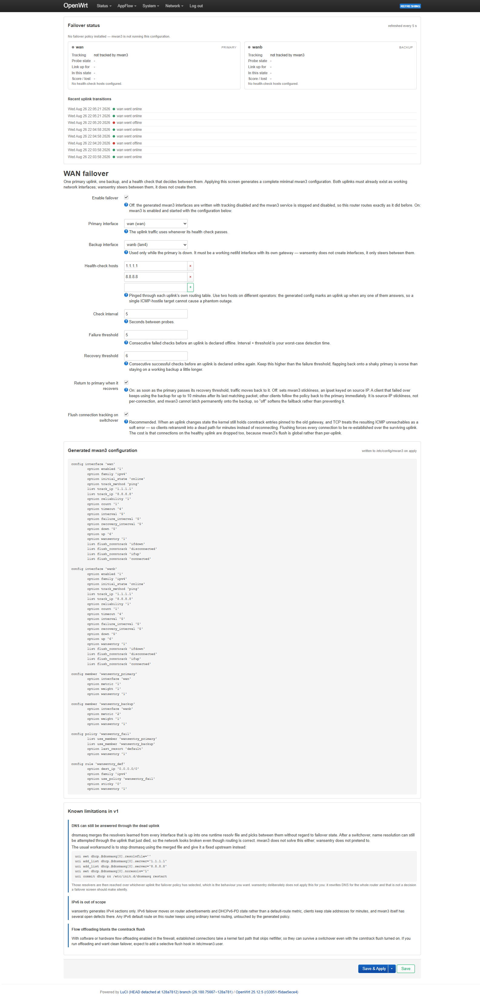
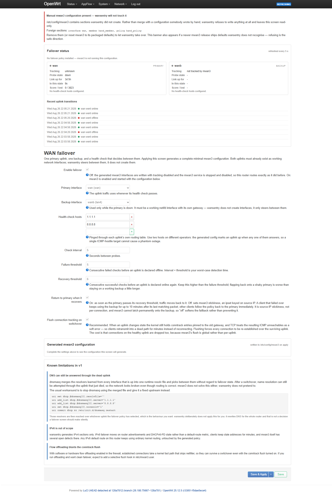

# luci-app-wansentry

**Dual-WAN failover on OpenWrt, in one screen and about five minutes.**

`wansentry` does not implement failover. It *generates* the mwan3 configuration
that implements failover, from ten fields on a single LuCI page, and then owns
what it generated. Pick a primary uplink, pick a backup, name two health-check
hosts, apply. Provided both uplinks already exist as configured network
interfaces, nothing else has to be visited.

**It is VPN aware, and that is not a checkbox.** If your router steers some
traffic through a VPN using policy-based routing, turning on failover can
silently defeat those policies. Nothing breaks and nothing is logged: traffic
keeps flowing and quietly stops going where you sent it, which on a country
exit means the affected devices begin appearing in the wrong country.
`wansentry` detects that arrangement, generates the mwan3 rules that prevent
it, and tells you on screen which policies it protected and which it could not.

There is a guide to the whole subject in
[docs/VPN-AND-POLICY-ROUTING.md](docs/VPN-AND-POLICY-ROUTING.md): how to tell
whether your own tunnel survives a switchover, two settings that look like
tidy-ups and are not, and the part that has nothing to do with your VPN and
derails more setups than anything else, which is DNS. It ends with the commands
to measure your own router rather than trust the numbers in it.

> Status: **working, and failover is verified on hardware.** A live switchover
> under load has been measured on two independent uplink types: a wired primary
> failing over to cellular, and the same primary failing over to a second
> broadband line on separate Wi-Fi. Both switched in 13-14 s against a 15 s
> detection threshold and failed back in 31 s against a 30 s recovery
> threshold, confirmed by interface byte counters rather than status output.
> Config generation, the ownership refusal, rollback and service reconciliation
> are verified too, as is coexistence with policy-based routing and a VPN:
> measured on a bench built to replicate a real production stack rather than a
> clean two-WAN rig, because a clean rig cannot reproduce any of it. See *Known limitations* for what remains, chiefly that this
> is IPv4 only and does not solve DNS.

## Why

mwan3 is the right engine for this. It is actively maintained, and every sharp
edge in dual-WAN failover (probe hysteresis, multi-target tracking, conntrack
flushing on switchover, hotplug integration) is something it has already
iterated on for a decade. That is not the problem.

The problem is that mwan3 is a *general* policy-routing tool, and its LuCI app
exposes that generality: separate configuration tabs for Interfaces,
Members, Policies and Rules, plus globals, and further tabs for status. A pure failover setup needs six
sections across five of those screens, and none of the concepts it makes you
learn are ones you asked about. The recurring forum complaint is not that mwan3
does not work; it is that the documentation is "huge and complex" for what
people consider a basic two-uplink job.

Several projects have answered that by reimplementing failover from scratch,
starting around 2010: `simplefailover`, `Adze1502/mwan`,
`GTANAdam/openwrt-wan-failover-script`, `belliash/wanmonitor` and others. Most
are now unmaintained, and the one adjacent tool with real traction,
`br101/pingcheck`, does detection only and deliberately leaves failover to
something else. Dates and current status for each are tabulated in
[docs/DESIGN.md](docs/DESIGN.md) section 2, so you can check that reading
rather than take it on trust.

The conclusion wansentry draws from that history is that the gap worth filling
is a simpler *configuration* path onto mwan3, not another failover mechanism.
That is a judgement, not a measurement, and it is the premise the whole
package rests on.

## How it compares

| | `luci-app-mwan3` | `luci-app-wansentry` |
|---|---|---|
| Scope | Every mwan3 feature: load balancing, weights, arbitrary policies and rules | Failover only: one primary, one backup |
| Screens for a working setup | Several: Interfaces, Members, Policies, Rules, plus status | 1 |
| Fields | Every mwan3 option, on every section | 9 |
| Configuration model | You write mwan3 config | wansentry generates it, and shows you exactly what it wrote |
| Backend | mwan3 | mwan3 (same engine, same package) |
| Coexistence | It *is* the mwan3 editor | Refuses to touch mwan3 config it did not create |
| Policy routing and VPNs | Not its job: you write whatever rules you need | Detects `pbr` policies and generates the mwan3 exclusions that keep them working |

They are not really competitors. Use wansentry to get failover working; if you
later need load balancing or per-destination policies, install
`luci-app-mwan3` and configure it there.

**What "hands off" actually looks like, because "steps aside" was too soft a
phrase for it.** The moment wansentry sees an mwan3 section it did not write,
it stops managing mwan3 entirely: the settings form goes read-only, a banner
names the foreign sections, and applying is refused rather than merged. The
service-side reconciler follows the same rule and leaves the mwan3 service
alone at boot. Nothing you configured elsewhere is modified or removed, but
this is a clean handover, not graceful coexistence, and you will find a
read-only page rather than a page that quietly defers.

**What counts as "ours", precisely**, since the whole safety promise rests on
it. A section is wansentry's only if **both** of these hold:

- its type is one of `interface`, `member`, `policy` or `rule`, and
- it either carries `option wansentry '1'` or is named `wansentry_*`.

A section of any other type is foreign no matter what it is called, so an
`mwan3` config carrying, say, a `notify` section is not ours to manage even if
somebody named it `wansentry_notify`. That rule is implemented twice, in the
browser and in the init script, and the two are held to agreement by
`tests/ownership-suite.sh`, which exists because they have drifted before.

## What it generates

Two `interface` sections (tracking options mapped from the form), two `member`
sections at metric 1 and 2, one failover `policy`, and one default `rule`, and the
complete minimal mwan3 failover configuration and not one section more.
The only exception is mwan3's own `globals` section, which wansentry adds
(with `mmx_mask`) if and only if the system does not already have one; a
stock mwan3 install ships it, so normally nothing is added. The
screen renders the exact text before you apply it. Regeneration is idempotent:
applying an unchanged configuration produces zero uci operations.

## Opinions it holds

- **Any one health-check host answering keeps an uplink up.** ICMP-hostile
  upstreams are common; demanding that every target respond turns one of them
  into a phantom outage.
- **Recovery is slower than failure.** The recovery threshold defaults higher
  than the failure threshold, because flapping back onto a shaky primary is
  worse than staying on a working backup a little longer.
- **A returning uplink has to prove itself before it gets traffic back.**
  mwan3 defaults to assuming an interface that comes back is working;
  wansentry generates the opposite. Pull a cable and both are fine, because
  the link and the internet return together. Power-cycle a modem and they do
  not: carrier is back in seconds, the service behind it takes far longer, and
  assuming otherwise hands traffic to an uplink that cannot carry it. Measured,
  that costs a second outage of roughly nine seconds. This is why the failover
  test everybody runs, pulling the cable, does not catch it.
- **Conntrack is flushed on every transition by default.** Established
  connections carry per-flow NAT and routing-mark state that still points at
  the uplink that just failed; until those entries expire they keep steering
  traffic down the dead path, so they are cleared on the switch.
- **If both uplinks are marked offline, traffic falls through to the kernel
  routing table** rather than being blackholed. A tracking false positive
  should degrade to plain routing, not to a total outage.
- **IPv4 only in v1.** IPv6 failover does not move on a default-route metric,
  and pretending otherwise does not solve it.

Each of these is argued, with sources, in [docs/DESIGN.md](docs/DESIGN.md).

## If your router already runs pbr or a VPN

This is the case most failover guides skip, and it is the one where getting it
wrong is hardest to notice.

**pbr and mwan3 both do policy routing, and mwan3 wins.** Their fwmarks do not
collide (pbr masks on `0x00ff0000`, mwan3 on `0x00003f00`), but their `ip rule`
priorities do: mwan3 installs at 1001-3002 and pbr at 29995-30000, and rules are
evaluated in ascending order. So when both have marked a packet, mwan3's table
is consulted first and **pbr's policy never runs.**

Nothing breaks when this happens. Traffic keeps flowing, both packages report
success, and neither logs a thing. Your traffic just stops going where you sent
it. If you use pbr for a country exit, the affected devices quietly start
appearing in the wrong country.

wansentry detects pbr and generates an mwan3 rule for each range your policies
claim, carrying `use_policy 'default'` and ordered ahead of the catch-all, so
mwan3 stands aside for that traffic and pbr's decision survives. Everything
outside your pbr ranges still fails over normally. The settings screen tells you
which policies it protected, and names any it could not.

The division of labour that results is the right one: **pbr decides what enters
the tunnel, wansentry decides which uplink the tunnel rides on.**

**Your VPN probably does not need restarting.** Measured on OpenVPN 2.7 against
a server that negotiates `peer-id`, a `nobind` client roams to the new uplink
mid-session: zero packets lost on a clean link failure, and about ten seconds on
a dead-upstream failure, which is mwan3's own detection time rather than the
tunnel's. `ping-restart 120` never fires because nothing restarts. A planned
"restart the tunnel on switchover" feature was dropped once that was measured,
because it would have been a disruption fixing a problem that does not occur.

Older OpenVPN, a server without float, and WireGuard are all plausibly
different and none of them has been measured. For those, and for anything else
that needs a nudge when the uplink changes, drop an executable script in
`/etc/wansentry.d/`; it is run with `WANSENTRY_OLD` and `WANSENTRY_NEW` set.
There is deliberately no "run this command on switchover" field in the web UI,
because that is remote command execution handed to whoever holds the failover
ACL.

**If your router runs a VPN, read [docs/VPN-AND-POLICY-ROUTING.md](docs/VPN-AND-POLICY-ROUTING.md).** It covers this, why DNS is the most
likely reason a working failover looks broken, how to tell whether your own
tunnel survives a switchover, two settings that look like tidy-ups and are
not, and a set of commands for measuring your own router rather than
trusting the numbers here. The engineering rationale is in
[docs/DESIGN.md](docs/DESIGN.md) section 11.

## What it does not solve

DNS. dnsmasq merges upstream resolvers from every interface that is up and
picks between them without regard to failover state, so name resolution can
still be attempted through the uplink that just died. mwan3 does not solve this
either. wansentry shows the failure mode and the dnsmasq workaround on screen
rather than pretending the problem does not exist.

## Screenshots

The settings screen, with both uplinks chosen and the mwan3 configuration it
will write rendered in full before anything is applied:

And the hand-off. This is what you get if `/etc/config/mwan3` already contains
anything wansentry did not write. Every field is disabled, the foreign sections
are named, and nothing is generated:

## Tests

Three suites, 146 checks, no failures. Nothing reimplements the logic it tests:
an earlier suite kept its own copy of the ownership arithmetic and every one of
those checks passed against a reconciler that was known to be broken, because
the copy was right when the shipped code was not.

| suite | checks | what it does |
|---|---|---|
| `tests/generator-suite.js` | 80 | loads the real browser module under Node and classifies the same configurations the shell suite drives, plus the pbr exclusion logic. Needs no router; runs on every push. |
| `tests/ownership-suite.sh` | 29 | drives the installed init script on a sandbox router, with configurations chosen because the two halves of the ownership rule *could* read them differently. |
| `tests/hardware-suite.sh` | 37 | the ownership gate, arming, reconciler restart discipline, the security cases, pbr coexistence and the switchover hooks. |

Every check names, in a comment written before the assertion, the smallest edit
to the *product* that turns it red. That is not a house style: running those
sabotages is what found two checks in this round that could not fail at all, one
of which was the check meant to catch non-determinism.

The `pbr` group **skips loudly** when pbr is not installed, and the run reports
the number of checks that did not run. A group that skips silently reads as a
passing group to anyone scanning the tail of the output.

The first two exist because the ownership rule is implemented twice and a rule
implemented twice drifts. They use the same fixtures, in the same notation, so
the two implementations are held to one answer. Details in
[CONTRIBUTING.md](CONTRIBUTING.md).

## Install

**This package is not in the official OpenWrt feeds**, so there is no one-line
install from a stock device. Build it with the OpenWrt SDK for your release and
architecture, then install the resulting package.

Build:

    # from an OpenWrt SDK tree matching your device's release
    ./scripts/feeds update -a
    ./scripts/feeds install -a
    git clone https://github.com/VolanticSystems/luci-app-wansentry.git \
        package/luci-app-wansentry
    make package/luci-app-wansentry/compile V=s

Install on the device (copy the built package over first):

    apk add --allow-untrusted /tmp/luci-app-wansentry-*.apk   # pulls in mwan3

`--allow-untrusted` is required because a locally built package is not signed
by an OpenWrt repository key. On releases still using opkg, use
`opkg install ./luci-app-wansentry_*.ipk` instead.

Then **Network → WAN Failover**.

## Uninstalling

Removing the package **does not tear down failover.** The generated mwan3
configuration stays in `/etc/config/mwan3` and mwan3 keeps running it, so the
router carries on failing over exactly as before. That is deliberate: removing
a configuration front end should not drop your connections or silently change
how the router routes.

If you want the failover configuration gone as well, remove the sections
wansentry created before or after removing the package. They are all marked, so
they are easy to find:

    uci show mwan3 | grep "wansentry='1'"

    for s in $(uci show mwan3 | grep "wansentry='1'" | cut -d. -f2 | cut -d= -f1 | sort -u); do
        uci delete mwan3.$s
    done
    uci commit mwan3
    /etc/init.d/mwan3 stop && /etc/init.d/mwan3 disable

Nothing else wansentry installed survives removal.

## Known limitations

Documented up front rather than left to be discovered.

- **IPv4 only.** wansentry generates no IPv6 failover configuration. On a
  dual-stack network IPv6 traffic is unaffected by a failover and will continue
  to use the failed uplink's route until that route goes away. mwan3 itself can
  express IPv6 rules; wansentry deliberately does not generate them in v1,
  because IPv6 failover does not reduce to a default-route metric and doing it
  badly is worse than not doing it.
- **Detection is not instant, and that is deliberate.** An uplink is declared
  down only after `interval x failure threshold` seconds, five and three by
  default, so expect roughly 15 s before traffic moves, and roughly 30 s before
  it moves back (`interval x recovery threshold`). Measured on hardware at 13-14 s
  and 31 s. Shortening the interval detects faster and flaps more; the defaults
  favour not flapping.
- **Existing connections are dropped on a switchover** when conntrack flushing
  is on, which is the default. That is the point: entries pinned to the dead
  uplink would otherwise keep steering traffic down it. But mwan3's flush is
  global rather than per-uplink, so connections on the healthy uplink are
  dropped too.
- **DNS is not solved, and cannot be solved here.** dnsmasq merges upstream
  resolvers from every interface that is up and does not consult failover
  state, so name resolution can still be attempted through a dead uplink.
  mwan3 has the same gap. wansentry surfaces the failure mode and the dnsmasq
  workaround on screen instead of pretending otherwise. This is the most
  likely reason a switchover that worked correctly looks broken from the
  sofa, so it is worth fixing before you need it:
  [docs/VPN-AND-POLICY-ROUTING.md](docs/VPN-AND-POLICY-ROUTING.md) section 3.
- **Failover only, by design.** No load balancing, no per-destination policy
  routing. If you need those, use mwan3 directly; wansentry deliberately
  refuses to grow into a second mwan3 UI.
- **A new uplink will look broken until you add it here.** While failover is
  armed, mwan3 steers traffic through its own routing tables by firewall mark.
  An interface that exists but is not named as your primary or backup is not in
  that model, so traffic bound to it gets marked onto a managed table and fails,
  even though the link itself is perfectly healthy. Symptom: you add a second
  WAN, it associates and gets a DHCP lease, and then cannot reach anything.
  The fix is to select it as the backup on this screen and apply, or to switch
  failover off while you test the new link. This is mwan3 working as designed,
  not a fault in the interface.
- **wansentry only touches what it created.** It will not modify or remove
  mwan3 configuration it did not generate, and the service-side reconciler
  applies the same rule. An existing hand-built mwan3 setup is left alone, and
  wansentry will decline to manage it rather than adopt it.

## A sibling package

[`luci-app-appflow`](https://github.com/VolanticSystems/luci-app-appflow) is a
per-application traffic dashboard: it uses netifyd's deep packet inspection to
show which applications and which devices are using the connection, live and
over the past hour. Same author, same OpenWrt release. It answers "what is on
this link", where wansentry answers "keep the link up"; the two are
independent and neither requires the other.

## License

Apache-2.0, see [LICENSE](LICENSE).
